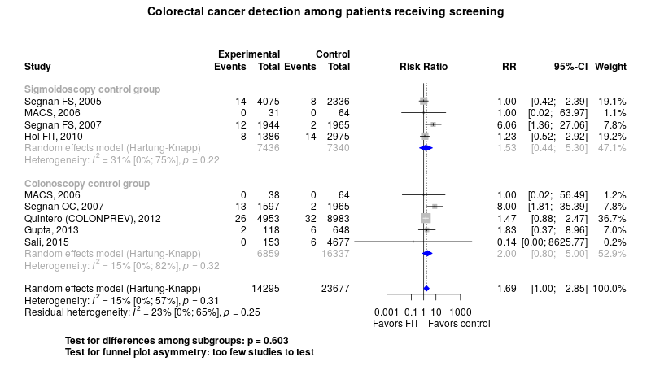

Colorectal cancer screening with fecal immunohistochemical test (FIT)
============================================
A living systematic review  

**Clinical summary:** This meta-analysis suggests that clinical intervention *is* effective. However, the benefit among the patients who received screening almost significantly favors optical screening. Heterogeneity of results as measured by I2 was '[might not be important](http://handbook-5-1.cochrane.org/chapter_9/9_5_2_identifying_and_measuring_heterogeneity.htm)' at 15%. This review updates previously published meta-analysis(es).(citation[s] below)

Meta-regression not performed.
* [Reconciliation of conclusions with prior meta-analyses](files/reconciliation-tables/Reconciliation%20of%20conclusions.pdf) (under construction)
* [Keep current with this topic](files/searching/Keep-up.md) (under construction)

Acknowledgement: we acknowledge the essential work by the authors of the prior [systematic review(s)](#systematic-reviews) listed below.

**Methods overview:** This repository is an [openMetaAnalysis](https://openmetaanalysis.github.io/) that combines methods of scoping, rapid, and living systematic reviews.  This analysis updates one or more previously published review(s) below. A comparison of studies included in this review compared to prior reviews are in the table, [reconciliation of trials included with prior meta-analyses/](files/reconciliation-tables/Reconciliation%20of%20studies.pdf). Newer studies included are listed in the references below. Rationale for newer trials excluded may be listed at the end of the references. 
* [Methods](http://openmetaanalysis.github.io/methods.html) for openMetaAnalysis
* [Evidence search](files/searching/evidence-search.md) for this review (under construction)

**Results:** Details of the studies included are in the:
* [Reconciliation of trials included with prior meta-analyses/](files/reconciliation-tables/Reconciliation%20of%20studies.pdf) (under construction)
* [Description of studies (PICO table)](files/study-details/table-pico.pdf) (under construction)
* [Risk of bias assessment](files/study-details/table-bias.pdf) (under construction)
* [Forest plots](../master/files/forest-plots) ([source data](files/data))
* [Network plots](../master/files/network) (optional)
* [Reconciliation of conclusions with prior meta-analyses](files/reconciliation-tables/Reconciliation%20of%20conclusions.pdf) (under construction)

The forest plot for the primary outcomes are below. Additional [forest plots](files/forest-plots) of secondary analyses may be available. 

<!-- The meta-regression for the primary outcomes are below. Additional [meta-regressions](files/metaregression) of secondary analyses may be available. 

The GRADE Profile is below. 
-->
References:
----------------------------------

### Systematic review(s)
#### Most recent review at time of last revision of this repository

### Randomized controlled trials
#### New studie(s) *not* included in the most recent review above
1. Imperiale TF, Gruber RN, Stump TE, Emmett TW, Monahan PO. Performance Characteristics of Fecal Immunochemical Tests for Colorectal Cancer and Advanced Adenomatous Polyps: A Systematic Review and Meta-analysis. Ann Intern Med. 2019 Mar 5;170(5):319-329. doi: [10.7326/M18-2390](http://dx.doi.org/10.7326/M18-2390). Epub 2019 Feb 26. PMID: [30802902](http://pubmed.gov/30802902)

#### Trial(s) included in the review above
1. Gupta S, Halm EA, Rockey DC, Hammons M, Koch M, Carter E, Valdez L, Tong L, Ahn C, Kashner M, Argenbright K, Tiro J, Geng Z, Pruitt S, Skinner CS. Comparative effectiveness of fecal immunochemical test outreach, colonoscopy outreach, and usual care for boosting colorectal cancer screening among the underserved: a randomized clinical trial. JAMA Intern Med. 2013 Oct 14;173(18):1725-32. doi: 10.1001/jamainternmed.2013.9294. PMID: [23921906](http://pubmed.gov/23921906); PMCID: PMC5228201.
2. Hol L, van Leerdam ME, van Ballegooijen M, van Vuuren AJ, van Dekken H, Reijerink JC, van der Togt AC, Habbema JD, Kuipers EJ. Screening for colorectal cancer: randomised trial comparing guaiac-based and immunochemical faecal occult blood testing and flexible sigmoidoscopy. Gut. 2010 Jan;59(1):62-8. doi: 10.1136/gut.2009.177089. PMID: [19671542](http://pubmed.gov/19671542).
3. Multicentre Australian Colorectal-neoplasia Screening (MACS) Group. A comparison of colorectal neoplasia screening tests: a multicentre community-based study of the impact of consumer choice. Med J Aust. 2006 Jun 5;184(11):546-50. PMID: [16768659](http://pubmed.gov/16768659).
4. Sali L, Mascalchi M, Falchini M, Ventura L, Carozzi F, Castiglione G, Delsanto S, Mallardi B, Mantellini P, Milani S, Zappa M, Grazzini G; SAVE study investigators. Reduced and Full-Preparation CT Colonography, Fecal Immunochemical Test, and Colonoscopy for Population Screening of Colorectal Cancer: A Randomized Trial. J Natl Cancer Inst. 2015 Dec 30;108(2):djv319. doi: 10.1093/jnci/djv319. PMID: [26719225](http://pubmed.gov/26719225).
5. Segnan N, Senore C, Andreoni B, Arrigoni A, Bisanti L, Cardelli A, Castiglione G, Crosta C, DiPlacido R, Ferrari A, Ferraris R, Ferrero F, Fracchia M, Gasperoni S, Malfitana G, Recchia S, Risio M, Rizzetto M, Saracco G, Spandre M, Turco D, Turco P, Zappa M; SCORE2 Working Group-Italy. Randomized trial of different screening strategies for colorectal cancer: patient response and detection rates. J Natl Cancer Inst. 2005 Mar 2;97(5):347-57. doi: 10.1093/jnci/dji050. PMID: [15741571](http://pubmed.gov/15741571).
6. Segnan N, Senore C, Andreoni B, Azzoni A, Bisanti L, Cardelli A, Castiglione G, Crosta C, Ederle A, Fantin A, Ferrari A, Fracchia M, Ferrero F, Gasperoni S, Recchia S, Risio M, Rubeca T, Saracco G, Zappa M; SCORE3 Working Group-Italy. Comparing attendance and detection rate of colonoscopy with sigmoidoscopy and FIT for colorectal cancer screening. Gastroenterology. 2007 Jun;132(7):2304-12. doi: 10.1053/j.gastro.2007.03.030. Epub 2007 Mar 21. PMID: [17570205](http://pubmed.gov/17570205).

#### Trial(s) undergoing review
1. Chen H, Lu M, Liu C, Zou S, Du L, Liao X, Dong D, Wei D, Gao Y, Zhu C, Zhu L, Zheng W, Xiao H, Kong Y, Yin H, Zhou H, Ying R, Wang B, Zhang J, Zhang X, Zhang Q, Zhang X, Zhang Y, Wang H, Guo L, Liu L, Ren J, Shi J, Li N, Miao X, Brenner H, Dai M. Comparative Evaluation of Participation and Diagnostic Yield of Colonoscopy vs Fecal Immunochemical Test vs Risk-Adapted Screening in Colorectal Cancer Screening: Interim Analysis of a Multicenter Randomized Controlled Trial (TARGET-C). Am J Gastroenterol. 2020 Apr 13. doi: 10.14309/ajg.0000000000000624. Epub ahead of print. PMID: [32282342](http://pubmed.gov/32282342).

#### Trial(s) excluded - selected list of important trial(s)

#### Cited by
This repository is cited by:

1. WikiDoc contributors. Pending content page. WikiDoc. Nov 9, 2014. Available at: http://www.wikidoc.org/index.php/This_topic. Accessed November 9, 2014. 

-------------------------------
[Cite and use this content](https://github.com/openMetaAnalysis/openMetaAnalysis.github.io/blob/master/reusing.MD)  - [Edit this page](../../edit/master/README.md) - [License](files/LICENSE.md) - [History](../../commits/master/README.md)  - 
[Issues and comments](../../issues?q=is%3Aboth+is%3Aissue)

